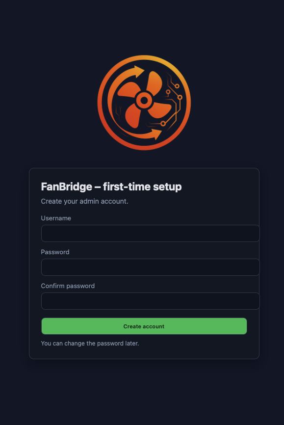
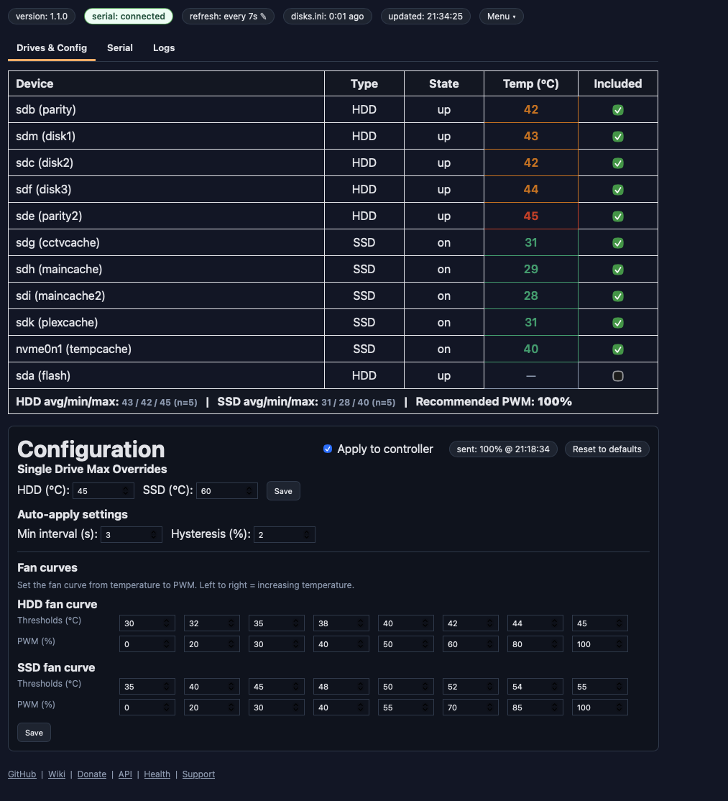
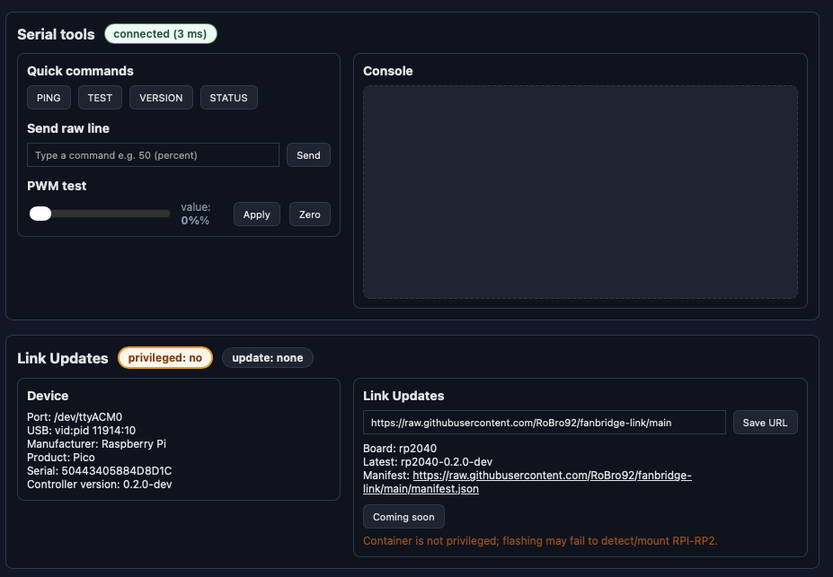
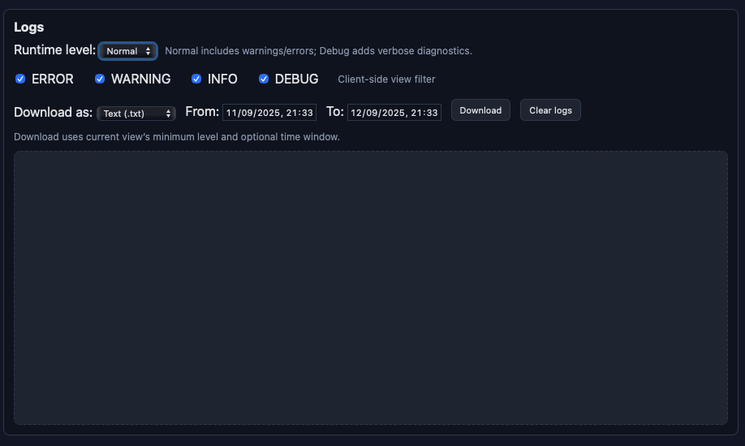
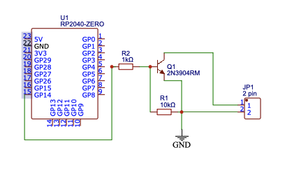
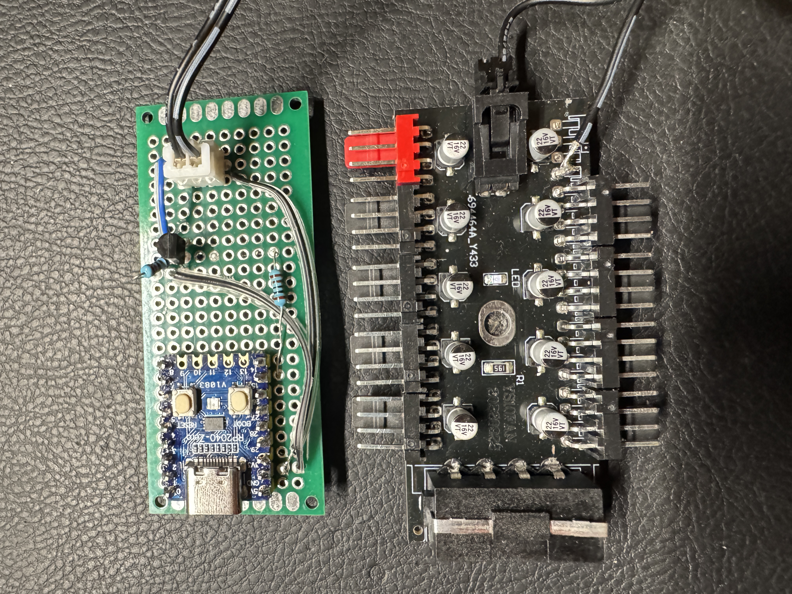

  

# FanBridge v1.1.0

FanBridge is a Dockerised Unraid service designed to monitor hard drive temperatures and intelligently control external PWM fans via Arduino or RP2040 microcontrollers. It provides a seamless way to keep your drives cool by adjusting fan speeds based on drive temperature data, helping to extend drive lifespan and reduce noise.

Production‑ready fan control bridge for Unraid.

## Features

- Parses Unraid `disks.ini` for drive state/temps and recommends PWM.
- USB serial control for Arduino/RP2040; quick tools (PING, version).
- Configurable fan curves, overrides, excludes; reset to defaults.
- Auth (login, change password), CSRF, sensible security headers.
- Logs API (ring buffer) and basic Prometheus metrics.
- Clean UI with dark/light mode and responsive layout.

## Screenshots

Below are a few key views from the web UI.

  <strong>Login</strong> 
  
   
  <em>Initial authentication screen with username/password.</em>
  

  <strong>Drives</strong> 
  
   
  <em>Drive overview and configuration used to compute fan PWM.</em>
  

  <strong>Serial</strong> 
  
   
  <em>USB serial controller status, quick tools, and send interface.</em>
  

  <strong>Logs</strong> 
  
   
  <em>Built‑in logs viewer and ring buffer controls.</em>
  

## Controller Wiring

If you are building the physical controller, see the companion firmware/bridge repo: [fanbridge-link](https://github.com/robro92/fanbridge-link).

Notes about the hub wiring:
- The hub used in our build presents the tach signal on the second wire/pin. Disconnect this tach line from the hub connector and instead tie that second wire to a ground point on the controller board.
- From the fan hub to the controller we only connect two signals: PWM and GND. Do not feed the tach line into the controller.

Schematic and a real‑world mockup are shown below.

  <strong>Schematic</strong> 
  

  <strong>Perfboard mockup</strong> 
  

## Usage

Run fanbridge easily via Docker or as an Unraid app:

### Unraid App

Install fanbridge directly through the Unraid Community Applications plugin for one-click deployment and management.

Unprivileged setup (device optional — container starts without it):
- Leave the Device mapping blank by default so Docker can start even if the controller is unplugged. You can add the device later when connected.
- Optionally map `/dev/serial/by-id` into the container read-only (for stable names).
- Preferred serial port defaults to `/dev/ttyACM0` (RP2040). You may override via `FANBRIDGE_SERIAL_PORT` (by-id path recommended).
- Keep “Privileged” off. No cgroup rules or group-add are required when using Device mapping.

Notes on hot‑plugging:
- Docker/Unraid cannot start a container if a specific `--device` path is mapped but absent on the host. Leaving the Device blank avoids this. You can add the device later when it’s connected, or restart the container after mapping it.
- Mapping `/dev/serial/by-id` (ro) is safe even when empty; it helps the app find a stable path when the controller is connected.

Production tips:
- Reverse proxy/TLS recommended; set `FANBRIDGE_SECURE_COOKIES=1` when HTTPS terminates in front.
- Tune Gunicorn via env: `GUNICORN_WORKERS` (default 2) and `GUNICORN_TIMEOUT` (default 30).
- Metrics: scrape `/metrics` (text format) for basic counters.
- Session secret: generated on first run and persisted at `/config/secret.key` (Docker) or `container/secret.key` (local). This file is ignored by Git; do not commit it.

## Roadmap

- Historical charts and richer dashboards.
- Live updates via WebSocket/SSE for smoother refresh.

## Release Notes (1.1.0)
- Modularized codebase (core/, services/, api/), added app factory.
- Production “sim” mode removed (local dev only). Starts without mounts/devices.
- Default preferred serial in Docker is `/dev/ttyACM0` (RP2040); logs error if unplugged.
- Unraid template clarifies serial device left blank by default; recommended `/dev/ttyACM0`.
- Image cleanup: removed unused `smartmontools`.

See `fanbridge/RELEASE.md` for the full changelog.

## Project Structure

- `container/app.py`: Flask app entry, app factory, middleware, routes not yet moved to blueprints.
- `container/api/`: Route groups (blueprints):
  - `serial.py` – `/api/serial/*` for status/tools/send/pwm
  - `appinfo.py` – `/api/app/version`, `/api/metrics`
  - `logs.py` – `/api/logs*` (list, level, clear, download)
- `container/services/`: Core services
  - `disks.py` – Unraid `disks.ini` parser, sysfs helpers
  - `serial.py` – serial discovery/open/status and helpers
- `container/core/`: Infrastructure utilities
  - `logging_setup.py` – logging setup + in-memory ring buffer
  - `metrics.py` – counters used by `/api/metrics`
  - `http.py`, `appver.py` – minimal HTTP JSON fetch and version helpers
- `container/templates/`, `container/static/`: UI assets
- `container/Dockerfile`: Runtime image
- `docker-compose.yml`: Local dev example
- `unraid-templates/templates/my-fanbridge.xml`: Unraid template
- `RELEASE.md`: Canonical version + changelog

## Changelog
For the canonical version history and detailed changelog, see `fanbridge/RELEASE.md`.
