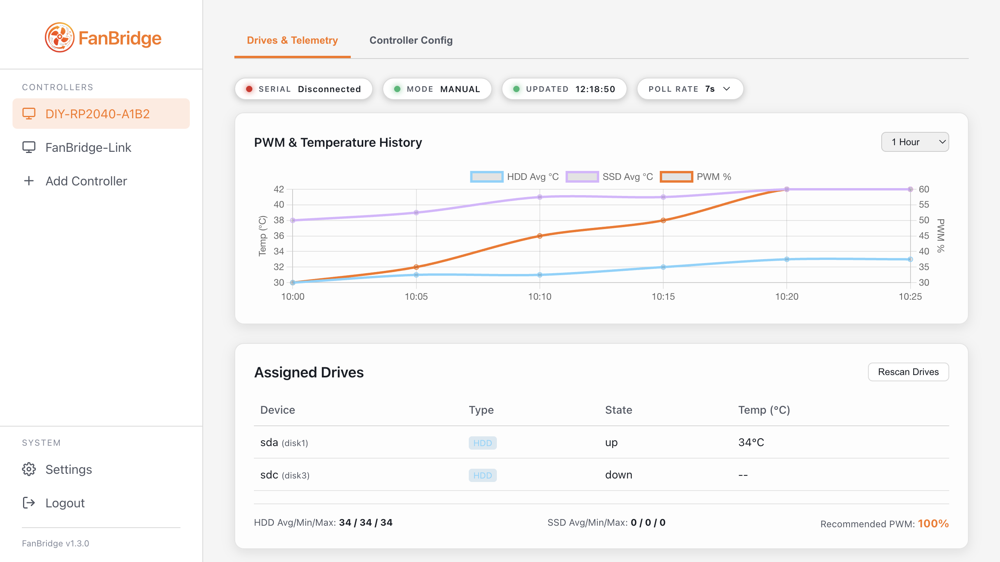
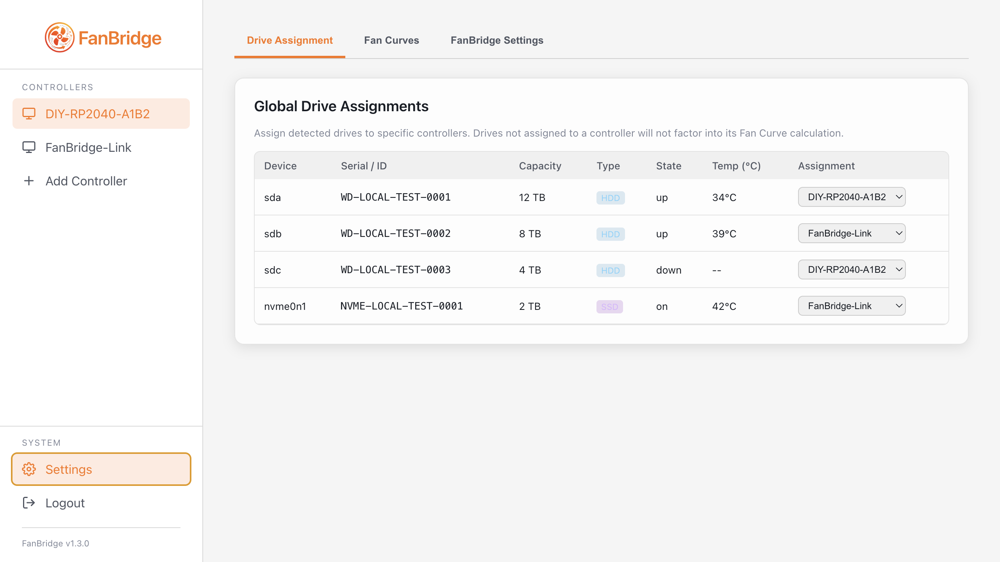

<p align="center">
  
</p>

<h1 align="center">FanBridge</h1>

<p align="center">
  Unraid disk temperatures in. Safe, controller-specific PWM demand out.
</p>

FanBridge is a Dockerised Unraid service that reads the temperature and state data written by Unraid, calculates cooling demand, and controls external PWM fan hardware over USB serial. Drives are assigned to individual controllers, so separate enclosures or cooling zones can follow their own disks without a global controller fallback.

FanBridge 1.4.0 supports the single-channel DIY RP2040-Zero controller. The six-channel FanBridge Link custom PCB is represented in the application design, but its production hardware and firmware remain under development and must not use the DIY firmware image.

> [!IMPORTANT]
> FanBridge controls physical cooling hardware. Automatic output is opt-in, unsafe or stale telemetry resolves to the configured fail-safe output, and every deployment must be validated with the actual fans, controller, USB path, and Unraid host before unattended use.

## Current interface

The following captures show the FanBridge 1.4.0 controller dashboard and global drive-assignment workflow. Values shown in the captures are local test telemetry; production images do not generate demo controller, disk, history, or log data.

### Controller telemetry

<p align="center">
  
</p>

### Per-controller drive assignments

<p align="center">
  
</p>

## What FanBridge does

| Capability | Behaviour |
|---|---|
| **Unraid temperature input** | Reads `/unraid/disks.ini`, including drive identity, state, type, temperature, serial number, and capacity. FanBridge does not query SMART directly. |
| **Controller-specific zones** | Assigns each disk to one controller or leaves it unassigned. There is no global/all-controllers assignment. |
| **Temperature-to-PWM policy** | Uses separate HDD and SSD curves, hottest-drive demand, hysteresis, single-drive overrides, and configurable idle/fail-safe output. |
| **Persistent hardware identity** | Protocol-2 DIY firmware exposes a full flash UID. FanBridge stores settings against that UID and can rebind the board after a USB device-path change. |
| **Safe host ownership** | One process owns controller sessions and runs the background control loop. Browser requests only read state or submit explicit configuration changes. |
| **Operational visibility** | Provides controller dashboards, history, authenticated logs, serial diagnostics, and authenticated Prometheus-format metrics. |
| **Hardened first run** | Uses a one-time setup token, strong administrator passwords, login throttling, CSRF protection, hardened cookies/headers, and atomic private configuration files. |

## Supported controller targets

| Product | Identity | Channels | Status |
|---|---|---:|---|
| **DIY FanBridge Link** | `FANBRIDGE_DIY`, `rp2040-zero` | 1 | Supported by the source in `fanbridge-link/rp2040`. Firmware 2.5.2 adds persistent identity, LED identification, safe host-control leasing, and in-app verified updates. |
| **FanBridge Link custom PCB** | Separate production identity required | 6 | Planned. Hardware design, production firmware, release stream, and speaker-based identification are not yet approved. |

The two products require separate board identities, build targets, versions, compatibility gates, and release artifacts. Never flash `fanbridge-rp2040-*.uf2` to the future six-channel custom PCB.

See the [controller firmware and wiring guide](fanbridge-link/README.md) and the [custom-PCB engineering specification](hardware/fanbridge_link_spec.md).

## Install on Unraid

FanBridge is not currently available in the public Community Applications feed while its listing is migrated. Install the version 2 template manually from an Unraid terminal:

```bash
mkdir -p /boot/config/plugins/dockerMan/templates-user
curl --fail --location --proto '=https' --tlsv1.2 \
  --output /boot/config/plugins/dockerMan/templates-user/my-fanbridge.xml \
  https://raw.githubusercontent.com/RoBroLabs/fanbridge/main/unraid-templates/templates/my-fanbridge.xml
head -n 2 /boot/config/plugins/dockerMan/templates-user/my-fanbridge.xml
```

Confirm the output starts with the XML declaration and `<Container version="2">`, then open **Docker → Add Container**, select **FanBridge** from the template list, and leave **Privileged** off. The template pulls the stable `ghcr.io/robrolabs/fanbridge:latest` image; its settings match the Community Applications submission.

### Required mappings

| Setting | Host value | Container value | Access |
|---|---|---|---|
| **AppData** | `/mnt/user/appdata/fanbridge` | `/config` | Read/write |
| **Unraid emhttp** | `/var/local/emhttp` | `/unraid` | Read-only |
| **Controller 1** | `/dev/serial/by-id/<controller-id>` | `/dev/ttyACM0` | Device |
| **Controller 2** | A different `/dev/serial/by-id/<controller-id>` | `/dev/ttyACM1` | Device |

The template also sets the Web UI to host port `8080`, `FANBRIDGE_DISKS_STALE_WARN_SEC=600`, and `FANBRIDGE_SECURE_COOKIES=0`. Change the host port if `8080` is already occupied. Set secure cookies to `1` only when the Web UI is served through HTTPS.

Add further controllers with distinct container paths such as `/dev/ttyACM2`. Do not enable privileged mode, expose all of `/dev`, or create a second overlapping bind for `/unraid/disks.ini`.

Map the entire `/var/local/emhttp` directory because Unraid may replace `disks.ini` atomically. A bind to only the old file inode can silently stop receiving updates.

Full template instructions are in [unraid-templates/README.md](unraid-templates/README.md).

## First run

1. Start the container and open `http://<unraid-host>:8080/`.
2. If `FANBRIDGE_SETUP_TOKEN` was not preset, retrieve the generated token from the container log or the mapped AppData directory:

   ```bash
   docker logs FanBridge
   cat /mnt/user/appdata/fanbridge/setup.token
   ```

3. Create the first administrator with the setup token and a password of at least 8 characters.
4. Pass each physical controller into the container using its stable host `/dev/serial/by-id/...` path.
5. In **Add Controller**, press **Scan**, select a detected device, and use **Identify** when supported before adding it.
6. Open **Settings → Drive Assignment** and assign each disk to one specific controller or **Not Included**.
7. Review curves and fail-safe behaviour before enabling automatic output.

FanBridge removes its generated setup-token file after the first administrator is created. Treat `/config` as sensitive because it also stores the administrator database, session secret, configuration, history, and controller identities.

## Controller identity and USB reconnects

DIY firmware 2.4.0 and newer returns a full 16-character flash UID during `ID?`. FanBridge uses the complete UID—not the display name or the four-character suffix—as the binding key for the controller's name, drive assignments, curves, and settings.

Firmware 2.5.2 presents a recognition label in the form `DIY-RP2040-xxxx`. The final four hexadecimal characters are useful for matching a physical board to the UI but are not globally unique.

If a board moves to a different host USB port:

- A stable `/dev/serial/by-id/...` host mapping is still preferred.
- FanBridge can rebind an exposed device only after an exact full-UID match.
- Docker cannot see a host device that was never passed into the container; correct the Device mapping and restart the container when necessary.
- Legacy protocol-1 firmware remains bound to its configured container path and should be upgraded before unattended use.

The Add Controller **Identify** action is deliberately bounded. For DIY firmware 2.5.2 it flashes the RP2040-Zero onboard WS2812 orange for ten seconds without creating or renewing the PWM control lease. Speaker identification for the custom PCB is not implemented.

## Temperature polling and fail-safe behaviour

FanBridge consumes the last sample written by Unraid. In **Settings → Disk Settings**, set **Tunable (poll_attributes)** to approximately 300 seconds and leave `FANBRIDGE_DISKS_STALE_WARN_SEC` near 600 seconds unless your installation has been deliberately qualified with another cadence.

The browser's refresh interval does not change how often Unraid queries drive attributes. When automatic output is enabled, the background control loop independently refreshes the controller command before the firmware's 60-second control lease expires.

Missing, malformed, stale, or incomplete active-drive telemetry is unsafe and produces the configured fail-safe demand. Sleeping or unassigned disks follow the idle policy instead. Verify these cases on the real server before relying on automatic control.

Manual mode bypasses temperature curves, but it does not bypass FanBridge's mandatory safety layer. A critical assigned-drive temperature, missing or stale active-drive telemetry, or an unhealthy control loop forces a controller-acknowledged 100% command. Critical-temperature protection remains latched until temperatures clear the configured threshold by 3°C. The DIY controller has no tachometer input, so an acknowledgement confirms the PWM target was accepted—not that the physical fan is spinning; validate the fan and electrical path before relying on unattended control.

## Docker CLI example

```bash
docker run -d \
  --name fanbridge \
  --restart unless-stopped \
  --security-opt=no-new-privileges \
  --cap-drop=ALL \
  --read-only \
  --tmpfs /tmp:rw,noexec,nosuid,size=16m \
  -p 8080:8080 \
  -v /mnt/user/appdata/fanbridge:/config \
  -v /var/local/emhttp:/unraid:ro \
  --device=/dev/serial/by-id/REPLACE_WITH_YOUR_CONTROLLER:/dev/ttyACM0 \
  -e FANBRIDGE_DISKS_STALE_WARN_SEC=600 \
  ghcr.io/robrolabs/fanbridge:latest
```

Useful deployment variables:

| Variable | Default | Purpose |
|---|---:|---|
| `FANBRIDGE_SETUP_TOKEN` | Generated | Optional first-run bootstrap token. Prefer leaving it unset for an interactive installation. |
| `FANBRIDGE_DISKS_STALE_WARN_SEC` | `600` | Age at which the Unraid temperature source becomes unsafe. |
| `FANBRIDGE_SECURE_COOKIES` | `0` | Set to `1` only when users reach FanBridge exclusively over HTTPS. |
| `GUNICORN_THREADS` | `4` | Concurrent request threads within the single hardware-owning process. |
| `GUNICORN_TIMEOUT` | `30` | Gunicorn request timeout in seconds. |

Do not set multiple Gunicorn workers. Controller sessions, state, and scheduling are process-local by design.

## Firmware updates

The controller configuration page can update a registered DIY RP2040 without privileged mode when `/dev/bus/usb` and the USB character-device rule from the Unraid template are present. Fan output is held at 100% while the controller enters BOOTSEL, the image is written, and its protocol identity is checked after restart.

Remote installation is intentionally restricted to the fixed `RoBroLabs/fanbridge` GitHub release path. FanBridge ignores releases older than the 2.5.0 safety baseline, drafts, prereleases, and any release without both the target-specific UF2 and its SHA-256 companion. The protected firmware workflow publishes that pair only for the version approved by the hardware-in-the-loop release gate. A local hardware-verified UF2 can also be uploaded through the same panel.

When an approved final DIY release is available, **Install latest approved firmware** offers it only after validating the target-specific asset and checksum. The older 2.1.0 and 2.2.0 releases are never offered. The future six-channel official PCB requires its own firmware identity and release channel and cannot use the DIY image. The checksum-verified host procedure remains documented in [fanbridge-link/README.md](fanbridge-link/README.md) as a recovery path.

## Security boundary

- Keep the Web UI on a trusted LAN or behind an authenticated HTTPS reverse proxy.
- Do not expose the plain HTTP service directly to the internet.
- Back up `/config`, restrict its host permissions, and never copy it into an image or support bundle.
- `/api/metrics` is protected by the normal login session; FanBridge does not currently issue a dedicated scraper token.
- Report vulnerabilities privately using the process in [SECURITY.md](SECURITY.md).

## Local development and validation

Build and run the current source locally:

```bash
docker compose up --build
```

Without `/unraid/disks.ini` or a passed-through serial device, FanBridge starts safely and reports those inputs as unavailable. Production images do not ship simulated disk or controller data.

Run the main validation gates:

```bash
python3 -m venv .venv
. .venv/bin/activate
python -m pip install -r container/requirements.txt pytest==9.1.1
python -m pytest -q

cd frontend
npm ci --ignore-scripts
npm audit --audit-level=high
npm run build
```

The pull-request workflow additionally compiles the RP2040 firmware, audits Python dependencies, runs Bandit and flake8 safety checks, builds the Docker image, smoke-tests its least-privilege runtime, and scans the result for vulnerabilities and secrets.

## Repository layout

| Path | Purpose |
|---|---|
| `container/app.py` | Flask application, configuration, authentication, controller registry, and control-loop integration. |
| `container/api/` | Serial, log, and application-information API blueprints. |
| `container/services/` | Unraid disk parsing, history, PWM policy, and serial discovery/transactions. |
| `frontend/` | Browser application source; Vite builds the production assets. |
| `fanbridge-link/rp2040/` | Single-channel DIY RP2040-Zero firmware source. |
| `hardware/` | Six-channel custom-PCB requirements and design material. |
| `unraid-templates/` | Unraid version 2 Docker template and installation guide. |
| `tests/` | Backend policy, migration, authentication, identity, and security regression tests. |

For release history see [RELEASE.md](RELEASE.md). Firmware changes are tracked independently in [fanbridge-link/CHANGELOG.md](fanbridge-link/CHANGELOG.md).
