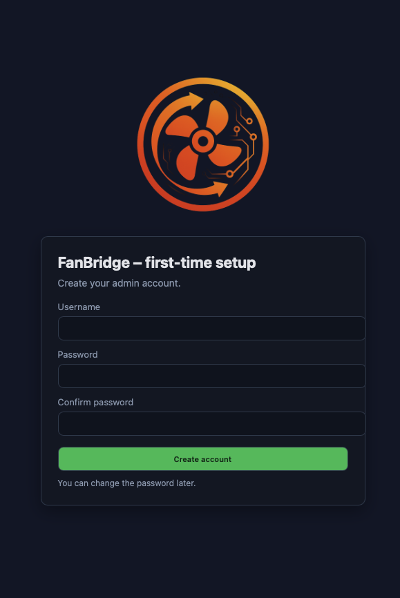
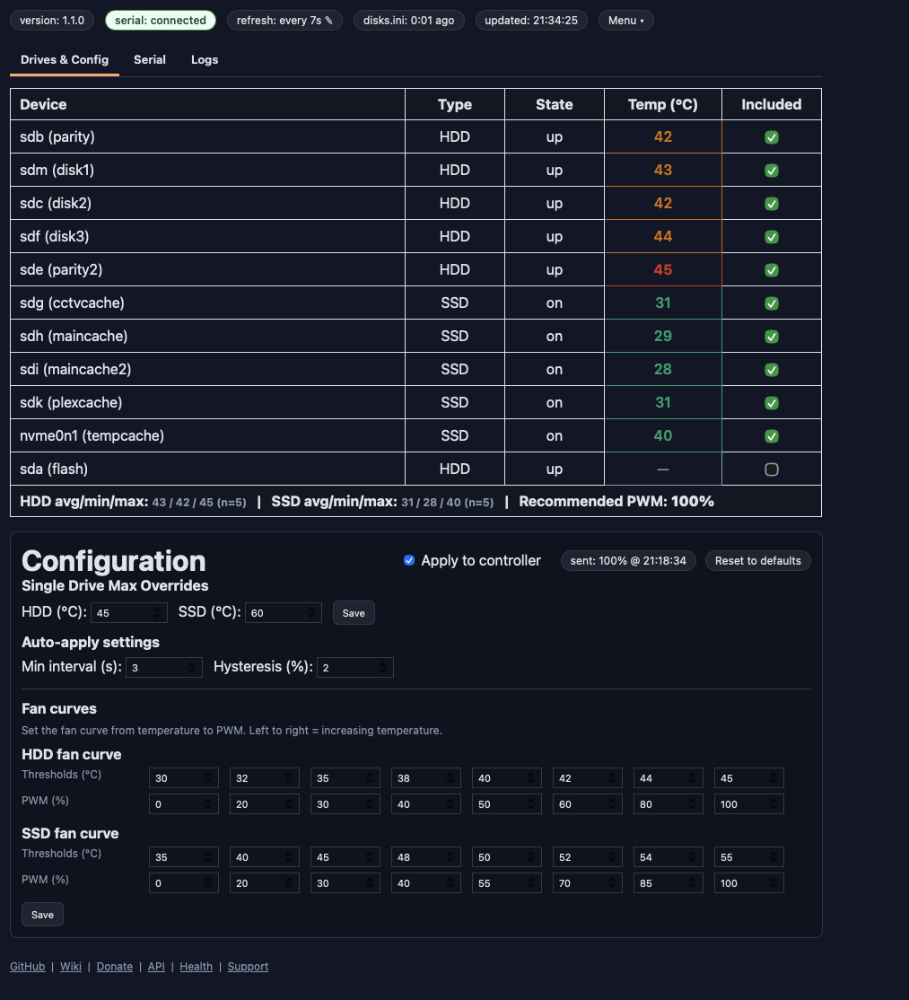
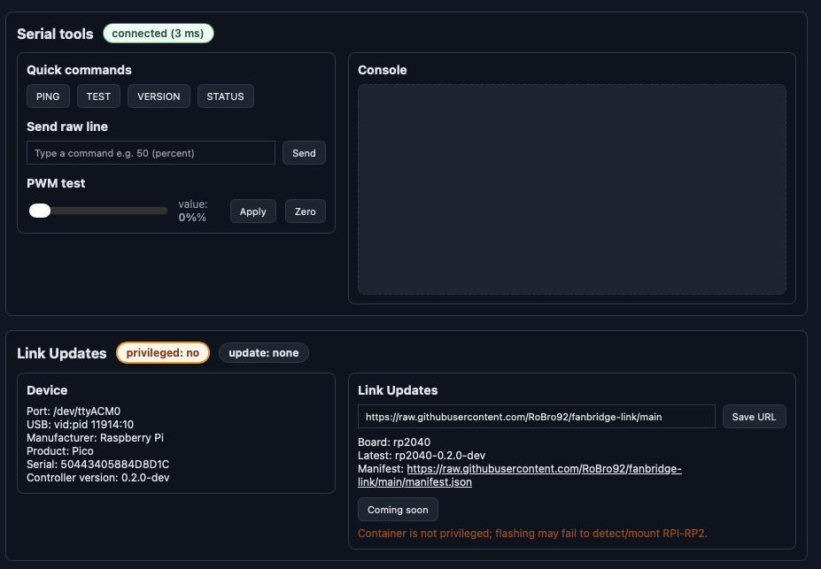
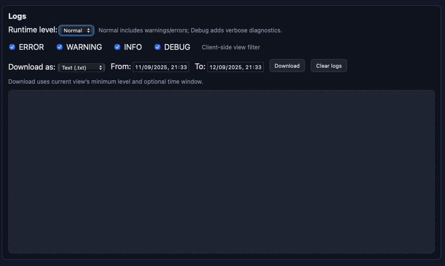

  

FanBridge is a Dockerised Unraid service designed to monitor hard drive temperatures and intelligently control external PWM fans via Arduino or RP2040 microcontrollers. It provides a seamless way to keep your drives cool by adjusting fan speeds based on drive temperature data, helping to extend drive lifespan and reduce noise.

## Features

| Feature | Description |
|---|---|
| **Intelligent PWM Control** | Parses Unraid `disks.ini` for drive state and temperatures to recommend optimal PWM. |
| **USB Serial Interface** | Seamless USB serial control for Arduino/RP2040 with quick tools (PING, version). |
| **Highly Configurable** | Configurable fan curves, manual overrides, drive exclusions, and default resets. |
| **Secure Web UI** | Clean UI (dark/light mode) with authentication, CSRF protection, and secure headers. |
| **Observability** | Built-in logs API (ring buffer) and Prometheus metrics for monitoring. |

## Screenshots

  <strong>Login</strong> 
  

  <strong>Drives</strong> 
  

  <strong>Serial</strong> 
  

  <strong>Logs</strong> 
  

## Hardware Controller

FanBridge relies on the **FanBridge Link** hardware controller. A custom-designed PCB is currently in development to provide a streamlined, plug-and-play experience. 

For information on the FanBridge Link controller hardware setup and firmware, see the [fanbridge-link directory](fanbridge-link/README.md).

## Installation

FanBridge can be installed via Docker or as an Unraid app.

### Unraid App (Recommended)

Install FanBridge directly through the Unraid Community Applications plugin for one-click deployment and management.

| Parameter | Recommended Setting | Description |
|---|---|---|
| **USB Controller Device** | `/dev/ttyACM0` or `/dev/serial/by-id/usb-...` | Pass through the specific USB device. Required if not running Privileged. |
| **Serial path** | `/dev/serial/by-id` (read-only) | Optional mapping for stable path naming if passing through the whole directory. |
| **Privileged** | Off (see note below) | Enables auto-detection of all USB controllers without manual device mapping. Also needed for in-app firmware updates. |

*Note: The backend scans `/dev/serial/by-id/*`, `/dev/ttyACM*`, and `/dev/ttyUSB*` automatically.*

#### Enabling In-App Firmware Updates (Optional)

To use the firmware update feature from the FanBridge web UI, the container requires privileged access to mount the RP2040 BOOTSEL volume. Add these **advanced** settings in the Unraid Docker template:

| Parameter | Setting | Description |
|---|---|---|
| **Privileged** | On (or add `CAP_SYS_ADMIN`) | Required to mount the RPI-RP2 FAT volume inside the container. |
| **USB Bus** | `/dev/bus/usb` → `/dev/bus/usb` (rw) | Allows the container to see the RP2040 after it changes USB identity during BOOTSEL. |
| **Disk by-label** | `/dev/disk/by-label` → `/dev/disk/by-label` (ro) | Helps the container locate the RPI-RP2 boot volume by label. |

If you prefer not to run privileged, you can update firmware from the Unraid terminal instead — see the [firmware update guide](fanbridge-link/README.md).

### Production Tips

- **Proxy/TLS:** Reverse proxy and TLS are recommended. Set `FANBRIDGE_SECURE_COOKIES=1` when HTTPS terminates in front of the application.
- **Workers:** Tune Gunicorn via environment variables: `GUNICORN_WORKERS` (default 2) and `GUNICORN_TIMEOUT` (default 30).
- **Metrics:** Scrape `/metrics` (text format) for basic counters.
- **Session Secret:** Generated on the first run and persisted at `/config/secret.key` (Docker) or `container/secret.key` (local).

## Firmware Updates

| Method | Requires Privileged | Description |
|---|---|---|
| **In-App** (Serial → Link Updates) | Yes | Flash from the web UI — either from the configured repo or by uploading a `.uf2` file. |
| **Unraid Terminal** | No | Run commands directly on the Unraid host via SSH or the web terminal. |

For full instructions on both methods, see the [firmware update guide](fanbridge-link/README.md).

## Architecture

- `container/app.py`: Flask app entry, app factory, middleware.
- `container/api/`: Route groups (blueprints) for serial, app info, and logs.
- `container/services/`: Core services for parsing `disks.ini` and serial discovery.
- `container/core/`: Infrastructure utilities for logging and metrics.
- `fanbridge-link/`: FanBridge Link firmware source (e.g., RP2040).
- `unraid-templates/`: Unraid Docker templates.

## Changelog
For the canonical version history and detailed changelog, see `RELEASE.md`.
