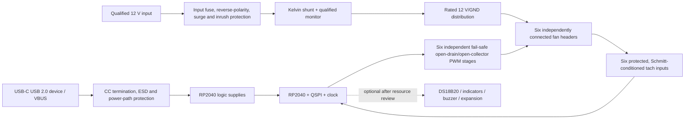

# FanBridge Link hardware requirements and design gate

> [!CAUTION]
> **DESIGN HOLD — NOT READY FOR SCHEMATIC RELEASE, PCB LAYOUT, PROCUREMENT, OR FABRICATION.**
>
> **Scope of this hold:** the new six-channel custom PCB and its production firmware only.
> It does not block the separately supported single-channel DIY Raspberry Pi Pico/RP2040
> controller in `fanbridge-link/rp2040`. The DIY target must continue to build, pass its own
> safety tests, and be releasable independently.
>
> The repository does not yet contain the six-channel production firmware. The current DIY
> firmware intentionally controls one PWM output and does not implement tachometer capture,
> current/voltage measurement, DS18B20 input, per-fan LEDs, or a buzzer. It uses only the
> RP2040-Zero development board's onboard WS2812 as a physical-identification light. It must
> not be used as evidence that the six-channel custom PCB is complete or safe.

This document is the engineering handoff and release checklist for the **six-channel custom
FanBridge Link PCB**. It
replaces the earlier concept-level notes, which contained unsafe PWM and tach interface
recommendations and an unsubstantiated 10–15 A power claim. Every requirement marked
**MUST** is a release gate unless an identified responsible engineer records a justified
deviation and the product owner accepts the resulting risk.

The intended product is a USB-connected controller for up to six independent 12 V,
four-wire PWM fans in a JBOD enclosure. Host software derives fan demand from Unraid disk
temperatures; the controller must continue cooling safely when the host, USB link, firmware,
or one of its sensors fails.

FanBridge therefore has two controller products with a shared host protocol family:

1. the existing one-channel DIY Pico/RP2040 controller, supported by the current firmware;
2. the future six-channel custom PCB, which requires a distinct board identity, firmware
   target, capability set, release artifact, and hardware qualification record.

Host software must select behavior from reported protocol/capabilities and must not infer
six-channel telemetry from a DIY controller or withdraw DIY support when the custom target is
introduced.

*Concept image only. It is not a placement drawing, dimensional drawing, current-path
analysis, connector selection, or approved layout.*

## 1. Normative references

Use the revisions below as design inputs and archive controlled copies with the hardware
release package. Where this document and a normative standard conflict, stop and resolve the
conflict in the requirements review rather than silently choosing one.

1. Raspberry Pi Ltd, [Hardware design with RP2040](https://datasheets.raspberrypi.com/rp2040/hardware-design-with-rp2040.pdf), current published revision. This is normative for the raw-silicon power, clock, flash, USB, reset, BOOTSEL, decoupling, grounding, and layout implementation.
2. Raspberry Pi Ltd, [RP2040 datasheet](https://datasheets.raspberrypi.com/rp2040/rp2040-datasheet.pdf), current published revision. This is normative for pin electrical limits, peripheral allocation, power sequencing, and absolute maximum ratings.
3. Intel Corporation, *4-Wire Pulse Width Modulation (PWM) Controlled Fans Specification*, Revision 1.3, September 2005 ([original publication path](http://www.formfactors.org/developer/specs/4_Wire_PWM_Spec.pdf); [readable copy of the Intel publication](https://www.manualshelf.com/manual/intel/dh67bl/4-wire-pulse-width-modulation-pwm-controlled-fans-specification.html)). This is normative for connector pinout, PWM control, tachometer signalling, polarity, and fan behaviour. The original hosting has been retired, so the engineer **MUST** archive and checksum a reviewed copy before sign-off.
4. Texas Instruments, [INA219 datasheet](https://www.ti.com/lit/ds/symlink/ina219.pdf), applicable orderable-device revision. This is normative only if INA219 remains the selected monitor.
5. USB Implementers Forum, [USB Type-C cable and connector specification](https://www.usb.org/document-library/usb-type-cr-cable-and-connector-specification-release-25) and USB 2.0 electrical requirements, applicable revision. These are normative for the USB-C sink/device implementation; do not copy a hobby-board schematic without checking it against the selected receptacle and current specification.

The engineer must also identify the applicable IPC current-carrying/layout standard,
product-safety requirements, EMC/ESD standards, flammability requirements, and environmental
limits for the intended sales region. These are unresolved product inputs, not optional
afterthoughts.

## 2. Release gates

Fabrication remains on hold until all of the following are complete and linked from the
hardware release record:

- [ ] Exact fan qualification set: manufacturer part number, cable/connector, rated and measured running current, startup/inrush, locked-rotor behaviour, maximum RPM, tach pulses per revolution, minimum controllable duty, and behaviour with PWM disconnected.
- [ ] Input power envelope: PSU type, cable type/length/gauge, connector part numbers, maximum continuous load, aggregate startup load, fault current, ambient temperature, and acceptable voltage drop.
- [ ] Six-channel GPIO/peripheral allocation frozen and reviewed against RP2040 PWM slices, capture implementation, boot state, SWD, USB, QSPI, I2C, and optional features.
- [ ] Power tree, protection strategy, shunt calculation, current-path calculation, worst-case thermal analysis, and power-state/backfeed analysis approved by an electrical engineer.
- [ ] Schematics peer-reviewed against the normative references; ERC clean with every waiver documented.
- [ ] PCB stack-up and copper weight defined; layout peer-reviewed; DRC clean; high-current and return-current analysis approved.
- [ ] Six-channel firmware and versioned protocol implemented on representative hardware. A one-channel breadboard build is not sufficient.
- [ ] Engineering prototypes pass the bring-up, safety, load, thermal, EMC/ESD pre-compliance, fault-injection, and endurance tests in this document.
- [ ] Manufacturing test fixture, programming procedure, calibration records, serial-number traceability, and pass/fail limits released.
- [ ] Final schematic, layout, Gerbers, drill data, assembly drawings, fabrication notes, BOM/AVL, firmware image/checksum, test report, and known-deviation list placed under revision control.

## 3. Required architecture

The USB and 12 V sources are **not galvanically isolated**: the fan control and tachometer
interfaces require a common signal reference. USB VBUS and the JBOD power rails must never be
shorted together or allowed to back-power one another. High fan return current must not flow
through the USB shield, USB cable ground path, or the MCU's sensitive ground reference.

## 4. External interfaces

### 4.1 Fan connectors

- **FB-CON-001:** Provide six independent four-wire fan connections with the Intel pin order: pin 1 ground, pin 2 +12 V, pin 3 tach/sense, pin 4 PWM control. Connector family, keying, latch, contact plating, and exact part numbers **MUST** be frozen in the interface drawing.
- **FB-CON-002:** Connector and contact ratings **MUST** exceed the qualified continuous and startup current at the worst ambient and mating-cycle condition. A generic “2.54 mm fan header” description is not a current rating.
- **FB-CON-003:** Silkscreen and assembly drawings **MUST** identify pin 1, connector function, polarity, and `FAN 1` through `FAN 6`; labels must remain visible when populated.
- **FB-CON-004:** Fan hot-plug support is not assumed. Either prohibit it in the user documentation or design and validate every power, PWM, tach, ESD, and inrush path for it.

### 4.2 Twelve-volt input

- **FB-CON-010:** Replace “4-pin Molex” with an exact manufacturer series and part number, mating part, terminal part, wire gauge, pinout, and derated per-contact current. Compatible-looking legacy peripheral connectors vary by source and quality.
- **FB-CON-011:** If the chosen connector exposes a 5 V contact, define it as no-connect unless a reviewed feature explicitly requires it. It must never connect to USB VBUS.
- **FB-CON-012:** Input polarity must be unambiguous mechanically and on silkscreen. Mis-mating, partial mating, reversed wiring, and a missing return conductor are required fault cases.

### 4.3 USB-C

- **FB-USB-001:** Implement a USB 2.0 device/upstream-facing port. The product does not source VBUS and does not negotiate USB Power Delivery.
- **FB-USB-002:** Both CC pins, D+/D− connectivity for the selected receptacle orientation, VBUS detection/power path, shield termination, and ESD protection **MUST** conform to the USB-C and RP2040 references. Values come from those references and the selected parts, not from this concept document.
- **FB-USB-003:** Place a low-capacitance USB-rated ESD device at the receptacle, minimize the unprotected path, route D+/D− as a controlled differential pair for the chosen stack-up, and avoid test-pad stubs that invalidate signal integrity.
- **FB-USB-004:** The regulator and power path must tolerate all defined USB/12 V power sequences without reverse current into the host, the fan supply, or an unpowered RP2040 I/O rail.
- **FB-USB-005:** Define shield-to-chassis/logic-ground treatment from an EMC and enclosure analysis. “Connect all grounds” is not an adequate USB shield requirement.

## 5. Six independent PWM output channels

Direct connection from an RP2040 push-pull GPIO to a fan PWM pin is prohibited.

- **FB-PWM-001:** Each fan **MUST** have its own open-drain or open-collector sink stage. A qualified small MOSFET or bipolar transistor implementation is acceptable when its drive network, leakage, sink voltage/current, transients, and unpowered behaviour are demonstrated against the Intel specification and every qualified fan.
- **FB-PWM-002:** The stage must only pull the fan's control input low or release it. It must not drive the line high and must not expose the RP2040 to the fan's internal pull-up voltage.
- **FB-PWM-003:** Target 25 kHz and remain inside the Intel-specified 21–28 kHz range over clock, component, temperature, and firmware tolerances.
- **FB-PWM-004:** PWM semantics are non-inverted at the fan connector: a continuously released/high control line represents full demand and a continuously asserted/low line represents zero demand. Because a low-side transistor inverts the GPIO action, firmware naming and tests **MUST** distinguish `fan_demand_percent` from transistor on-time/raw counter values.
- **FB-PWM-005:** On power-up, RP2040 reset, BOOTSEL, firmware update, unprogrammed flash, USB loss, logic power loss, and GPIO high-impedance state, all six sink stages **MUST** be off so all six PWM lines are released. Passive bias on every transistor control node must guarantee this without firmware.
- **FB-PWM-006:** A reset or watchdog event must never produce a low-going pulse long enough to stop a qualified fan. Verify boot-ROM and application pin transitions with an oscilloscope.
- **FB-PWM-007:** A supervisory mechanism independent of the normal control loop **MUST** reset or disable control so PWM outputs release after firmware/control-task failure. At minimum use the RP2040 watchdog with an independently serviced health policy; an external watchdog is preferred and any omission requires an explicit safety review.
- **FB-PWM-008:** Six channels must be independently commandable. Tying PWM lines together, duplicating one GPIO in layout, or reporting per-channel control while broadcasting one signal fails acceptance.
- **FB-PWM-009:** Any series resistance, gate/base bias, ESD component, or test point must be selected by calculation and must preserve the PWM low-level, leakage, rise/fall time, and 25 kHz waveform across the fan compatibility set.

## 6. Six independent tachometer inputs

The earlier 10 kΩ/0.1 µF suggestion has a nominal single-pole cutoff near 159 Hz. That can
erase valid pulses from a high-speed fan. A series Schottky diode also does not provide the
claimed voltage clamp or debounce function. Neither circuit is approved.

- **FB-TACH-001:** Provide one independent tach input and counter for every fan. No multiplexing that can miss simultaneous edges is allowed.
- **FB-TACH-002:** Treat the qualified fan tach output as open collector/open drain and provide a controlled board-side pull-up compatible with the RP2040 input network. Do not assume every unqualified server fan lacks an internal pull-up; characterize the actual compatibility set.
- **FB-TACH-003:** If a possible internal pull-up, miswire, or hot-plug event can exceed an unpowered or powered input's limits, use a deliberately designed current-limited clamp or level-translation stage. The buffer, protection parts, and RP2040 must remain inside absolute maximum and injection-current limits in every power state.
- **FB-TACH-004:** Use hysteresis at the digital receiving threshold, either in a qualified Schmitt-input buffer or an equivalent reviewed interface. Confirm the chosen input is tolerant of the maximum possible voltage; a 3.3 V LVC input is not automatically 5 V- or 12 V-tolerant.
- **FB-TACH-005:** Derive the analogue filter and digital glitch-rejection limits from the maximum qualified RPM and pulses per revolution:

  `maximum tach frequency = maximum RPM / 60 × pulses per revolution`

  Demonstrate with worst-case thresholds and tolerances that the shortest valid high and low
  pulses settle beyond the receiver thresholds with margin. Preserve valid edges while
  rejecting the specified noise pulse. Record calculations, simulation, and bench waveforms.
- **FB-TACH-006:** Firmware must support the qualified pulses-per-revolution value per channel, an overflow-safe edge counter, a defined measurement window, zero-RPM timeout, confidence/error state, and no-pulse detection without blocking PWM generation.
- **FB-TACH-007:** A stall decision must combine demanded PWM, spin-up grace time, minimum qualified running duty, and tach history. A fixed zero response, a single global RPM, or an instantaneous missing edge must not be reported as valid per-fan telemetry.
- **FB-TACH-008:** Validate tach operation at minimum and maximum speed, all six fans simultaneously, maximum cable length, noisy load switching, fan hot-plug if supported, and each open/short/miswire case.

## 7. Power distribution, protection, and measurement

### 7.1 Load definition and current-carrying design

- **FB-PWR-001:** The 10–15 A claim is **not approved**. Set the board rating only after measuring or obtaining guaranteed values for six-fan continuous, startup/inrush, and locked-rotor loads, then derate the connector, terminals, fuse, shunt, protection device, copper, vias, and fan headers at maximum ambient.
- **FB-PWR-002:** The lowest-rated element in the complete path—PSU harness, input contact, PCB, protection element, shunt, branch, output contact, or fan cable—sets the product rating.
- **FB-PWR-003:** Calculate copper width/thickness, planes, neck-downs, thermal reliefs, via arrays, connector-pin heating, and allowed voltage drop using the selected stack-up and an identified current-carrying standard. Confirm the calculation with temperature-rise and voltage-drop measurements on assembled boards.
- **FB-PWR-004:** Route fan supply and fan return as a high-current pair. Keep motor current out of logic/USB return paths and the shunt sense routing. Define where power ground, logic ground, USB ground, and shield meet, supported by return-current analysis.
- **FB-PWR-005:** Account for simultaneous startup and firmware-commanded spin-up. Confirm the PSU and board do not brown out, oscillate, reset, or exceed connector/shunt/protection ratings.

### 7.2 Fault protection

- **FB-PWR-010:** Provide input overcurrent protection sized to protect the weakest conductor/contact and with adequate voltage, interruption, pulse, temperature, and lifetime ratings. A nominal “10 A hold” PTC is not accepted without hot/cold resistance, trip-time, ambient derating, fault-energy, and enclosure-temperature evidence.
- **FB-PWR-011:** Decide and document whether each fan branch needs independent fuse/eFuse protection so one shorted fan or cable cannot disable cooling or overheat a branch before the input protection operates.
- **FB-PWR-012:** Provide reverse-polarity protection whose normal drop and dissipation meet the current/thermal budget and whose fault behaviour is safe. A series diode, ideal-diode MOSFET, or controller may be used only after calculation and validation.
- **FB-PWR-013:** Define the 12 V source transient environment and select surge/ESD suppression, voltage ratings, and energy ratings from it. A TVS part number must not be chosen before its standoff, clamp voltage, source impedance, pulse energy, and downstream absolute maximum limits are reconciled.
- **FB-PWR-014:** Analyse input hot-plug and bulk capacitance: connector arcing, inrush, PSU interaction, fuse stress, reverse discharge, and 12 V dip during aggregate fan start.
- **FB-PWR-015:** No fault may backfeed 12 V or the JBOD 5 V rail into USB VBUS, D+/D−, RP2040 GPIO, or an unpowered 3.3 V rail.

### 7.3 Current and voltage monitor

- **FB-MON-001:** An INA219 may monitor aggregate fan bus voltage and current only if its bus common-mode range, differential range, absolute maximum limits, accuracy, conversion time, I2C behaviour, and temperature range satisfy the final envelope. A 12 V nominal label does not prove transient compliance.
- **FB-MON-002:** Choose the shunt from the required maximum continuous and pulse current, desired resolution, selected PGA/range, total error budget, and allowed voltage drop. Calculate `P = I²R` at continuous load and transient energy at startup/fault; apply resistor and PCB thermal derating.
- **FB-MON-003:** Use true Kelvin sense connections at the shunt. Keep high-current copper out of the sense paths and verify polarity, common-mode transients, filtering, and calibration against the selected monitor's datasheet.
- **FB-MON-004:** Protect the shunt and monitor for a downstream short until the overcurrent device clears. The shunt must not become an unintentional fuse unless it is safety-rated and explicitly designed as one.
- **FB-MON-005:** Aggregate current cannot identify which fan stalled. Tach remains the primary per-fan motion feedback; current is supporting power/fault telemetry.
- **FB-MON-006:** Define factory calibration points, allowable gain/offset error, temperature drift, saturation indication, and firmware units before selecting the shunt and monitor variant.

## 8. Power-state and fail-safe matrix

The schematic, firmware, and qualification plan must demonstrate these outcomes with all six
qualified fans. “Full speed” means all six PWM control inputs are released and each fan's
documented disconnected-control behaviour has been verified.

| State or fault | Required hardware outcome | Required reported outcome when communication exists |
| --- | --- | --- |
| USB absent, 12 V present | PWM stages off/high-impedance; fans at qualified fail-safe speed; no MCU back-power through I/O | Not applicable |
| USB present, 12 V absent | Logic may operate; no power injected into fan rail; outputs remain electrically safe | Fan supply absent/undervoltage, current zero, RPM unavailable/zero with fault reason |
| USB and 12 V applied | No unsafe PWM pulse during boot; remain full speed until a valid, leased command is accepted | Boot/fail-safe state and all capability/version fields available |
| USB/serial command lease expires | All channels return to full speed within the approved safety interval | Lease-expired fault and age |
| Firmware hang or watchdog reset | Supervisor releases all PWM outputs; fan power remains available | Reset cause on reconnect |
| BOOTSEL/firmware update/unprogrammed flash | All PWM outputs released for the entire interval | Update/bootloader state if observable |
| Tach open/short/noisy | PWM cooling remains available; affected input cannot damage/back-power MCU | Per-channel tach invalid/fault, never fabricated RPM |
| Current monitor/I2C stuck | PWM generation and watchdog remain operational | Sensor invalid/fault; no stale value presented as current |
| One fan-power branch short | No fire/trace/contact damage; protection clears or limits the fault; remaining behaviour matches approved safety analysis | Branch/aggregate fault where detectable |
| Brownout, reversed input, or repeated hot-plug | No latch-up, backfeed, unsafe partial drive, or component damage within the specified envelope | Reset/power fault when communication recovers |

Non-Intel-compatible fans that stop when PWM is disconnected fail the default safety model and
must either be excluded or supported through a separately reviewed pull-up/driver strategy.

## 9. Raw RP2040 implementation

This board uses the RP2040 QFN device, not a Raspberry Pi Pico module. The complete raw-silicon
reference-design work is in scope.

- **FB-MCU-001:** Implement and peer-review every RP2040 supply, internal regulator connection, exposed pad/ground, decoupler, ADC supply/reference, clock, QSPI flash, reset/RUN, BOOTSEL, USB, and SWD requirement in the official hardware guide.
- **FB-MCU-002:** Select the 3.3 V regulator from worst-case MCU, flash, indicators, sensors, expansion load, USB supply tolerance, dropout, startup, transient, thermal, reverse-current, and stability requirements. “One 3.3 V LDO” is not a design.
- **FB-MCU-003:** Select a supported QSPI flash and boot-stage configuration. Validate cold/warm reset, watchdog reset, BOOTSEL, programming, and reset without flash power-cycling.
- **FB-MCU-004:** Calculate crystal load components from the selected crystal's specified load capacitance and measured/estimated PCB stray capacitance; follow the placement/grounding guidance. Do not use the former arbitrary capacitor range.
- **FB-MCU-005:** Place decoupling and bulk capacitance according to the reference layout, with short return paths and no high-current fan return sharing. Document every reference-design deviation.
- **FB-MCU-006:** Expose fixture-compatible SWDIO, SWCLK, RUN/reset, ground, and required power test access. BOOTSEL must work without relying on already-running application firmware.
- **FB-MCU-007:** Do not use Pico board assumptions in product firmware or schematics. In particular, ADC29 is not automatically a valid `VSYS/3` monitor on a raw RP2040 design. Add and calibrate an explicit divider only if logic-rail measurement is required.

## 10. GPIO and peripheral allocation freeze

Layout is prohibited while any required row is `TBD`. The electrical and firmware engineers
must jointly complete this table, including the RP2040 PWM slice/channel or capture resource,
boot/reset state, external pull direction, test point, and conflict review.

| Function | Count | GPIO/resource | Electrical interface | Boot/fail-safe state | Status |
| --- | ---: | --- | --- | --- | --- |
| Fan PWM 1–6 | 6 | TBD individually | Six sink-stage controls | Passive bias keeps every sink off | **BLOCKING** |
| Fan tach 1–6 | 6 | TBD individually | Protected Schmitt inputs/capture | No MCU back-power | **BLOCKING** |
| INA219 I2C SDA/SCL | 2 | TBD, one fixed I2C instance | 3.3 V I2C; bus-fault analysis required | Inputs/no back-power | **BLOCKING** |
| DS18B20 data | 1 | TBD | Protected 3.3 V 1-Wire if retained | Input | Open product decision |
| System/status indicators | TBD | TBD | MCU-driven or hardwired as defined | Must not imply healthy before self-test | Open product decision |
| Per-fan fault LEDs | 6 | TBD or reviewed expander/driver | Must not load tach | Off or explicit lamp-test state | Open product decision |
| Buzzer | 1 | TBD plus driver if retained | Active/passive device must be defined | Silent during reset unless safety case says otherwise | Open product decision |
| Expansion I2C | 2/shared | TBD | Must not let external faults disable onboard monitor/control | Safe with connector absent/shorted | Open product decision |
| ARGB | 1 | TBD plus level/power interface | 5 V logic/power domain must be defined | No parasitic powering | Open product decision |
| SWD / RUN / BOOTSEL | fixed/special | Per RP2040 reference | Manufacturing/debug access | Defined by reference design | **BLOCKING** |
| QSPI / crystal / USB | fixed/special | Per RP2040 reference | Dedicated implementation | Defined by reference design | **BLOCKING** |

Optional features must not be retained merely because GPIOs appear available. Confirm PWM-slice
mapping, simultaneous edge-capture capacity, CPU/PIO/DMA loading, I2C failure containment,
power budget, connector ESD, level translation, and firmware support first. A 5 V ARGB output,
for example, requires a defined 5 V source, current limit, connector budget, and compatible
logic level; it cannot be attached casually to the USB-powered 3.3 V domain.

## 11. Controller identity and host protocol contract

Hardware release requires a firmware/host compatibility contract, not an ad-hoc collection of
serial strings.

- **FB-PROTO-001:** Assign a lawful USB VID/PID strategy and stable product/manufacturer strings. Do not ship with a development-board identity or a VID/PID the project is not entitled to use.
- **FB-PROTO-002:** Every unit **MUST** expose a stable, unique USB serial identity suitable for `/dev/serial/by-id`. Define whether it is factory-programmed or derived from a qualified unique device/flash identifier. Record it against board serial number and test results; it is an identifier, not a security secret.
- **FB-PROTO-003:** The identification response **MUST** be machine-readable and include product ID, hardware revision, firmware version, protocol major/minor, unique serial, PWM-channel count, tach-channel count, and a capabilities list. `FANBRIDGE_DIY` alone is insufficient.
- **FB-PROTO-004:** Freeze request framing, encoding, line/message length, command IDs, per-command acknowledgement/error shape, units, numeric ranges, timeout, retry/idempotency behaviour, and forward-compatibility rules. Fuzz malformed, truncated, repeated, and out-of-order input.
- **FB-PROTO-005:** Setpoint commands **MUST** address an individual channel or an explicit all-channel operation and return requested versus applied demand. Read-only `PING`, identity, and telemetry commands must never renew the cooling-control lease.
- **FB-PROTO-006:** Telemetry **MUST** expose per-channel demand, applied PWM, RPM or invalid reason, tach age, stall/fault state, plus board supply/current measurements with value age and validity. It must expose fail-safe state, control-lease age/limit, reset cause, and sensor errors.
- **FB-PROTO-007:** A protocol-major mismatch or missing required safety capability must fail closed: the host must not assume successful control, and the controller must remain at full cooling demand.
- **FB-PROTO-008:** Define firmware-image compatibility by hardware revision and publish a checksum. RP2040 has no secure boot merely because a checksum exists; if malicious update resistance is required, specify a signed-update architecture and protected trust anchor as a separate security design.

Minimum capabilities for a board advertised as FanBridge Link are:

`pwm_channels=6`, `tach_channels=6`, independent setpoints, full-speed boot/reset/lease fail-safe,
per-channel RPM validity/faults, aggregate current/voltage validity, unique USB serial, hardware
revision, protocol version, and reset/fail-safe telemetry. Optional DS18B20, LEDs, buzzer, and
expansion functions must only be advertised when implemented and tested.

## 12. Indicators, sensors, and expansion

- A hardwired power LED means only that its local rail is present. It must not be labelled or interpreted as controller health.
- A firmware status indicator must distinguish boot, safe/full-speed, host-controlled, update, and fault states without briefly showing a false healthy state.
- Per-fan LEDs must be driven from validated firmware fault state or a reviewed hardware monitor; they must not load or clamp tach lines.
- Define the DS18B20 supply voltage, pull-up, connector pinout, cable length, ESD/miswire protection, CRC/error handling, and whether the reading affects control. A stale/CRC-failed sensor must not lower cooling demand.
- Define buzzer type, driver, acoustic requirement, mute/reset behaviour, duty limits, and failure mode before selection.
- External I2C must be isolated, buffered, switched, fused, or omitted so a shorted accessory cannot hang the onboard current monitor or normal fan control.
- Any 5 V ARGB function needs a separately budgeted 5 V power path, branch current limit, reverse-current analysis, 3.3-to-5 V-compatible signal interface, connector definition, and EMC review. It is deferred by default.

## 13. PCB layout, mechanical, and thermal requirements

- Freeze board outline, connector access, cable bend/retention, enclosure clearance, mounting-hole coordinates, fastener/standoff material, keep-outs, and maximum component height in a controlled mechanical drawing. “As compact as possible” and “holes in the extreme corners” are not dimensions.
- Define PCB material, layer count, finished copper weight, stack-up, surface finish, minimum feature sizes, controlled impedance, temperature rating, flammability rating, and assembly process with the fabricator.
- Keep USB and crystal routing within the RP2040 reference guidance. Keep the unprotected side of every ESD device short and direct.
- Place protection at the connector it protects. Place shunt and current monitor for Kelvin sensing, not visual symmetry. Place PWM/tach interfaces to minimize exposed/noisy traces and maintain serviceable channel grouping.
- Do not split ground planes casually. Partition placement and control return paths so fan current does not cross logic/USB reference regions; maintain a deliberate common reference.
- Provide copper and thermal spreading for the shunt, reverse-polarity element, fuse/eFuse, input contacts, and other dissipative parts based on worst-case calculations and measured enclosure airflow.
- Apply component voltage/current/power/temperature derating. The BOM must list exact manufacturer part numbers, lifecycle status, approved alternates, critical parameters, and substitution restrictions. Package-size preference (0603/0805 where practical) does not override electrical, creepage, pulse, thermal, or manufacturability requirements.
- Review fan, 12 V, USB, and expansion connectors for ESD contact discharge and cable-coupled emissions/immunity. Protect without violating signal thresholds or creating unsafe fault current.

## 14. Design-for-test and manufacturing

### 14.1 Required accessible nodes

Provide labelled fixture access, without creating USB stubs or compromising high-current paths,
for at least:

- signal ground, power ground as needed for diagnosis, USB VBUS, regulated 3.3 V, RP2040 core/regulator node required by the reference design, 12 V before protection, and 12 V after protection/shunt;
- all six PWM transistor-control nodes and all six fan-side PWM outputs;
- all six fan-side tach inputs and all six MCU-side conditioned tach signals;
- I2C SDA/SCL, current-monitor alert if used, DS18B20 data if fitted, RUN/reset, SWDIO, SWCLK, and a safe factory-programming power/ground connection;
- a practical way to measure each fan branch voltage/current or to connect a known electronic/fan load through the production connector.

Test-point form, spacing, tooling access, probe current rating, and keep-outs must match the
selected bed-of-nails or manual fixture. USB D+/D− test access requires signal-integrity review.

### 14.2 Per-unit manufacturing test

The released fixture and test program must:

1. verify identity/traceability, shorts/opens, input polarity path, rail voltages, regulator current, clock/flash, USB enumeration, unique serial, and firmware checksum/version;
2. command and measure every PWM channel independently at low, intermediate, and full demand, including its reset/high-impedance state and frequency;
3. inject known tach pulses independently and simultaneously into all six channels and verify RPM, zero timeout, invalid input, and channel isolation;
4. apply calibrated voltage/current points to verify monitor gain, offset, polarity, saturation/fault reporting, and stored calibration where applicable;
5. exercise indicators, buttons, DS18B20, buzzer, and expansion only when fitted and advertised;
6. record measured limits, result, board revision, firmware/protocol version, fixture/software version, calibration equipment, timestamp, and operator/station against the board serial.

## 15. Prototype bring-up and verification

### 15.1 Controlled bring-up order

1. Independent schematic/layout review, assembly inspection, unpowered resistance/diode checks, and shorts check.
2. Power logic from a current-limited USB source with 12 V absent; verify every rail, clock, reset, flash, USB, idle consumption, thermal state, and absence of voltage on the fan rail.
3. Apply current-limited 12 V with USB absent and no fans; verify protection, leakage/backfeed, PWM release state, shunt path, and thermals.
4. Apply both supplies with no fan, then one known low-current fan, then representative worst-case fans one at a time. Confirm polarity and waveforms before increasing current limit.
5. Exercise six independent PWM/tach channels at low load before aggregate startup, locked-rotor, fault, thermal, and endurance tests.

### 15.2 Electrical and functional acceptance

- Capture oscilloscope evidence for every PWM output at reset, BOOTSEL, firmware boot, 0/intermediate/100% demand, watchdog reset, USB removal, lease expiry, and 12 V sequencing. Verify frequency, low level, released level, rise/fall time, and channel independence over temperature and supply tolerance.
- Measure tach waveforms and reported RPM for every fan at minimum and maximum qualified speed, simultaneous six-channel edges, maximum cable length, and the defined noise/glitch injection. Verify PPR configuration and error states.
- Measure 12 V and ground voltage drop, connector/contact temperature, shunt/protection temperature, PCB hot spots, USB/logic temperature, and fan startup dip at nominal and worst ambient. Continue until thermal equilibrium.
- Compare current/voltage telemetry with calibrated equipment across the accepted range, temperature, startup pulse, zero current, reverse polarity indication where applicable, and saturation.
- Verify USB enumeration and stable unique `/dev/serial/by-id` identity across every reset/update/power sequence and multiple units connected simultaneously.
- Verify host commands cannot make one channel affect another and malformed protocol input cannot disable the watchdog, extend a lease, crash control, or fabricate healthy telemetry.

### 15.3 Mandatory fault injection

Test at least: fan absent; rotor locked; each fan power open/short; tach open/ground/overvoltage/noise;
PWM open/ground/fan-side overvoltage; current-sense input open/short; I2C SDA/SCL stuck; DS18B20
absent/CRC fault; USB disconnect/reconnect; serial silence and hostile serial traffic; MCU hang and
watchdog; RUN held; BOOTSEL; corrupt/blank flash; 12 V brownout/reversal/hot-plug; USB-only and
12 V-only states; branch short; input protection operation; and repeated recovery. Define safe
fixtures and current limits before deliberately shorting any node.

### 15.4 EMC, ESD, mechanical, and endurance

- Perform USB and external-connector ESD pre-compliance in powered and unpowered states, plus applicable conducted/radiated emissions and immunity testing with all six fans switching.
- Test source transients and cable-coupled disturbances from the approved environmental envelope; do not improvise surge levels at the bench.
- Perform maximum-load thermal soak, repeated aggregate fan starts, power cycling, USB reconnect/reset cycling, long-duration six-channel PWM/tach operation, and watchdog recovery. Define cycle counts and duration from the reliability target before test execution.
- Verify connector retention/mating cycles, cable strain, mounting/fastener clearance, enclosure short risk, service access, silkscreen legibility, and safe handling of the hottest component.

Any damage, reset, latch-up, backfeed, unsafe fan stop, corrupted identity, false healthy status,
or measurement outside the released limit is a failure, not an observation to waive informally.

## 16. Open engineering decisions

These must be resolved before the indicated gate. Do not infer answers from the concept image.

| Decision | Required evidence/owner | Must close before |
| --- | --- | --- |
| Exact six-fan compatibility list and electrical/mechanical envelope | Product owner + measured fan qualification report | Schematic |
| Rated board current and acceptable voltage drop/temperature rise | Electrical engineer calculation from qualified loads | Protection/BOM selection |
| Input connector/harness and branch connector part numbers | Electrical + mechanical engineers; manufacturer derating data | Schematic |
| Input fuse versus eFuse and per-branch protection | Electrical safety/fault analysis | Schematic |
| Reverse-polarity, surge, ESD, inrush, and hot-plug envelope | Electrical engineer + target-environment definition | Schematic |
| Current monitor architecture, shunt value/package, range, accuracy, calibration | Electrical + firmware engineers | Schematic |
| Six-channel GPIO/PWM/capture allocation | Electrical + firmware engineers | Schematic/layout |
| Independent watchdog architecture and safe timeout | Safety, electrical, and firmware review | Schematic |
| USB VID/PID entitlement and unique-serial provisioning | Product/legal/manufacturing + firmware | Firmware/interface freeze |
| Protocol schema, compatibility rules, update trust model | Host + firmware + security owners | Firmware/interface freeze |
| Whether DS18B20, LEDs, buzzer, external I2C, and ARGB belong in revision 1 | Product owner, with pin/power/fault budget | Schematic |
| Board outline, connector orientation, mounting, enclosure, cooling, ambient | Mechanical engineer + JBOD survey | Layout |
| Applicable safety/EMC/environmental/regulatory standards | Product/compliance owner | Architecture review |
| Manufacturing site capabilities, fixture interface, calibration and traceability | Manufacturing/test engineer | Layout/release |

## 17. Current implementation gap

As reviewed against `fanbridge-link/rp2040/src/main.cpp`, the repository firmware presently:

- drives one transistor gate (`GATE_PIN`) and applies one global setpoint;
- has no six-channel GPIO map or independent PWM commands;
- reports RPM as unsupported and captures no tach inputs;
- reads no INA219, shunt, DS18B20, fan fault LED, or buzzer; the RP2040-Zero onboard GPIO16
  WS2812 is used only for bounded pre-enrolment identification;
- identifies as `FANBRIDGE_DIY protocol=2 board=rp2040-zero channels=1 uid=<flash-id>`, reports
  explicit `pwm.single`, `failsafe.lease`, and `identify.led` capabilities, and gives the host a persistent
  application-level unit identity; it does not yet provision that value into a production USB
  serial descriptor or provide a full production hardware revision identity;
- reports unsupported supply telemetry as `null` rather than applying a Pico ADC assumption to
  the future raw-RP2040 board;
- has a safer full-speed boot/control-lease concept, but no demonstrated six-channel electrical fail-safe or production watchdog validation.

This is a valid, separately supported baseline for the one-channel DIY controller once its
own hardware-in-the-loop release tests pass. It is not the six-channel target. Therefore the
next **custom-hardware** milestone is requirements closure and a reviewed six-channel
engineering prototype, not a production PCB order. The custom-board design hold may be
removed only when the release gates and evidence above are complete.
