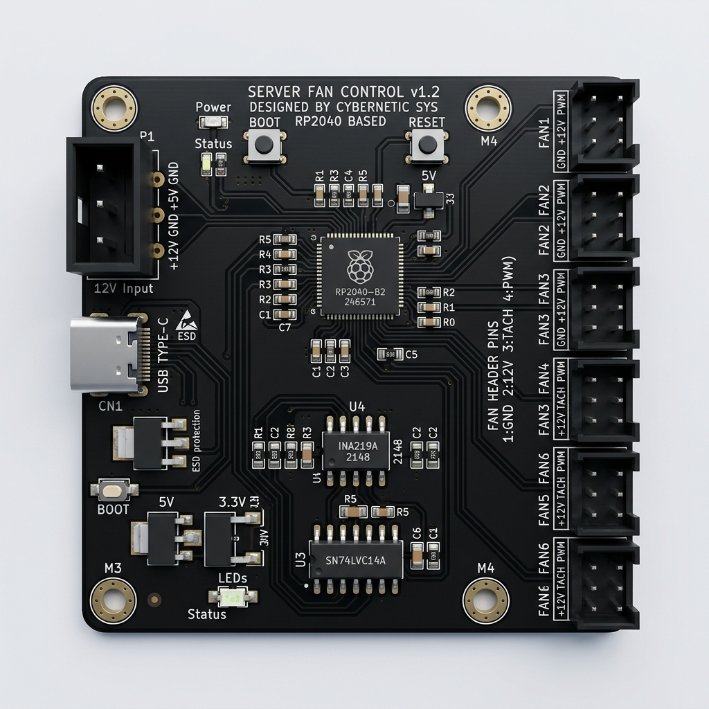
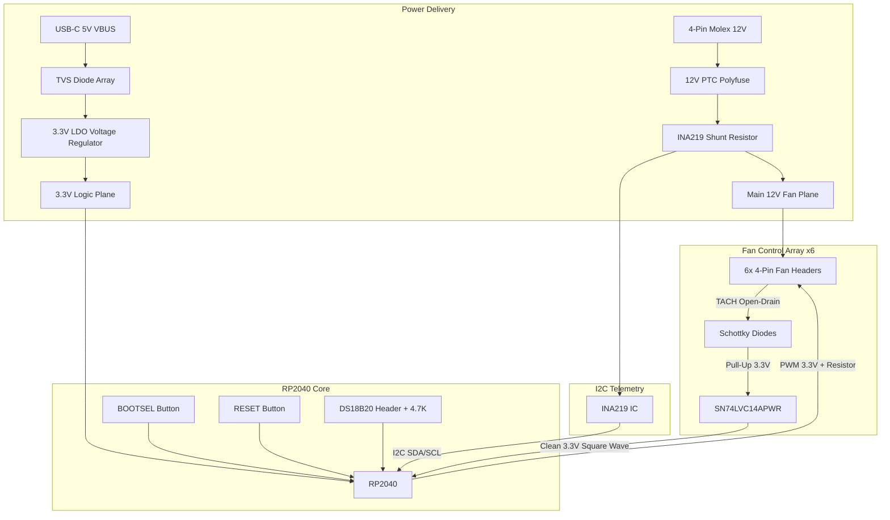

# FanBridge Link: PCB Design Specification

This document serves as the full scope and hardware specification for the **FanBridge Link**, a custom printed circuit board (PCB) designed to bridge Unraid drive temperatures to PWM fans in dumb JBOD enclosures. 

This spec is intended to be handed directly to a PCB Engineer or Electronics Designer for schematic capture and routing.

## 1. Concept & Scope

The FanBridge Link is an ultra-compact, robust fan controller driven by an RP2040 microcontroller. It connects to an Unraid Host via USB for data and logic power, while drawing high-current 12V power from a JBOD's internal power supply to drive up to 6 high-powered server fans.

*(Concept CAD Mockup - See Layout Requirements for exact placement rules)*

## 2. Core Bill of Materials (BOM) & Components

*Note: For all passive SMD components (resistors, capacitors, LEDs), use **0603** or **0805** imperial sizes. They are the perfect sweet spot for automated pick-and-place assembly while remaining large enough for DIY hand-soldering repairs if necessary.*

| Component | Recommendation / Spec | Purpose |
| :--- | :--- | :--- |
| **Microcontroller** | RP2040 (or Raspberry Pi Pico module for rev 1) | Core logic, PWM generation, TACH counting, and USB serial comms. |
| **USB Interface** | USB-C Receptacle (SMD, 16-pin or 24-pin) | Host data connection and isolated 5V power for the RP2040 logic. Must include 5.1kΩ pull-down resistors on CC pins. |
| **Power Input** | 4-Pin Molex (Through-hole, Right-Angle or Vertical) | Main power draw from JBOD PSU. Supplies 12V and 5V rails. |
| **Fan Headers** | 6x 4-Pin PWM Fan Headers (Standard 2.54mm pitch) | Connects to 12V, GND, PWM (Output), and TACH (Input). |
| **Temp Sensor Header** | 1x 3-Pin Header (2.54mm pitch) with 4.7KΩ Pull-up | For an external **DS18B20** Digital Temperature Sensor (Ambient intake temp). |
| **Audible Alarm** | 1x SMD Piezo Buzzer (Active or Passive, 3.3V) | Physical audible alerts for dead fans or critical temperatures. |
| **Status LEDs** | 2x 0603 or 0805 SMD LEDs (Blue, Green) | Diagnostic indicators for "USB Data Link" and "JBOD 12V Power Good". |
| **Current Sensor** | INA180, INA219, or INA226 (with Shunt Resistor) | High-side current sensing to detect stalled fan motors or electrical shorts. |
| **Polyfuse (PTC)** | 12V PTC Resettable Fuse (e.g., 10A hold) | Protects the board from catching fire if a fan cable severely shorts out. |

## 3. Critical Electrical Constraints

> [!CAUTION]
> **Ground Loop & Isolation Warning:** The RP2040 must be powered entirely from the USB-C 5V VBUS. The Fans must be powered entirely from the Molex 12V line. **DO NOT** connect the 5V VBUS from the USB to the 5V or 12V lines of the Molex connector. Only the **Ground planes** must be tied together. Failure to isolate the power rails will backfeed current into the Unraid host motherboard and destroy the USB controller.

### 3.1 Tachometer (TACH) Protection & Debouncing
PC Fan Tachometer pins are Open-Collector outputs. High-powered server fans (e.g., Deltas) often pull this pin up to 12V internally. Connecting this directly to the 3.3V-tolerant RP2040 will destroy the microcontroller. Furthermore, fan TACH signals are notoriously "noisy" and require debouncing.

For a professional, commercial-grade board (similar to ATX PC motherboards), use a **Hex Schmitt-Trigger Inverter IC** (e.g., SN74LVC14A) to clean the signals before they reach the MCU.

**Requirement per TACH channel:**
- **Schottky Diode:** Place a Schottky diode (e.g., BAT54) in series with the Fan header to block 12V backfeeding. (Cathode facing the fan).
- **Pull-Up & Filter:** A 10KΩ resistor pulling the MCU side of the diode to 3.3V, and a 0.1µF capacitor to Ground.
- **Buffer IC:** Route the filtered signal through 1 channel of a **SN74LVC14APWR** (Hex Schmitt-Trigger Inverter, TSSOP-14 package for space savings). This IC will snap the noisy analog waveform into a perfectly crisp, debounced 3.3V digital square wave, completely offloading the filtering work from the RP2040 firmware.

### 3.2 PWM Output Circuit
The RP2040 outputs a 3.3V PWM signal. Intel's 4-pin PWM fan specification states that fans expect a 5V or 3.3V PWM signal (pulled up to 5V internally by the fan). 
- **Requirement:** Route the RP2040 PWM outputs directly to the Fan Headers. Include a small current-limiting series resistor (e.g., 220Ω - 1KΩ) on each PWM line to protect the MCU pins in case of a short circuit.

### 3.3 Power & Fault Monitoring (INA219)
To prevent feature creep and minimize analog trace noise, all power telemetry is handled by a single digital I2C sensor rather than multiple ADC voltage dividers. 

**Requirements:**
- **Component:** Use a single **INA219** (e.g., INA219AIDCNR) placed at the main Molex 12V input.
- **Combined Telemetry:** The INA219 simultaneously measures the **Bus Voltage** (to detect if the JBOD's 12V power supply is failing or dropping voltage under load) and the **Total Current** (Amps) drawn by the entire fan array.
- **Fault Logic:** If the INA219 detects a massive current spike (e.g., from 1.5A to 5A) while any individual fan's tachometer drops to 0 RPM, the firmware deduces a locked-rotor motor stall and alerts the user.
- **PTC Resettable Fuse (Polyfuse):** Place a 12V high-current Polyfuse (e.g., 10A hold / 20A trip) at the Molex 12V input. If a fan cable physically shorts out, the Polyfuse will trip and break the circuit before traces on the PCB melt.

### 3.4 Commercialization & Durability (Final Touches)
For a premium commercial product that survives the hands of homelab users, the following must be included:
- **ESD Protection (TVS Diodes):** Users carry static electricity. Place an ESD TVS Diode Array (e.g., USBLC6-2SC6) on the USB-C Data lines (D+/D-) right at the connector. Ensure the Schottky diodes on the Fan TACH lines are rated to absorb static shocks when users hot-plug fans.
- **Physical Buttons:** The RP2040 requires a **BOOTSEL** tactile button (to pull the QSPI CS pin low during boot) to flash the initial firmware. A **RESET** tactile button (pulling the RUN pin low) is also highly recommended so users can reboot the microcontroller without unplugging the USB cable.
- **Silkscreen Labelling:** The silkscreen must be extremely clear for the end-user. Label all headers ("FAN 1", "FAN 2", "12V MOLEX IN", "USB-C HOST"). Add the project logo/name and a hardware revision number (e.g., `REV 1.0`).

### 3.5 RP2040 Core Implementation Requirements
This board will use the raw RP2040 silicon to maximize profit margins and eliminate reliance on third-party carrier modules. Your engineer must include the standard minimal viable RP2040 circuit:
- **External Flash Memory:** The RP2040 has **zero** internal flash. Include an external QSPI Flash chip (e.g., Winbond W25Q16 2MB, or generic equivalent SOP-8) to store the firmware. *(Note: Using an 'Extended Part' for a $0.15 2MB flash chip with a $3 setup fee is significantly cheaper at volume than using a $2.00 'Basic Part' 16MB chip).*
- **12MHz Crystal Oscillator:** USB communication requires high precision. You must include an external 12MHz crystal (e.g., SMD3225-4P, ±10ppm) and its associated load capacitors (e.g., 20pF-27pF depending on crystal spec).
- **Decoupling Capacitors & LDO:** Ensure 0.1µF capacitors are placed as physically close to the RP2040's 3.3V power pins as possible. Provide a 3.3V LDO regulator to step down the USB 5V VBUS to power the logic.

## 4. PCB Layout & Mechanical Spec

### 4.1 Dimensions & Mounting
The board must be as compact as possible while safely routing 12V traces capable of carrying up to 10-15 Amps total (assuming heavy-duty server fans).
- **Mounting Holes:** 4x M3 mounting holes in the extreme corners. Ensure a minimum 5mm keep-out zone around the holes for standard magnetic metal standoffs.
- **Trace Width:** The 12V and GND traces from the Molex connector to the 6 Fan headers must be extremely thick. Use copper pours/polygons on both top and bottom layers, heavily stitched with vias, to handle continuous high current.

### 4.2 Component Placement
- Place the **Molex connector** and **Fan Headers** on the same edge (or opposing edges) to keep the heavy 12V/GND copper pours completely isolated from the delicate 3.3V digital logic area of the RP2040.
- Place the **USB-C port** on an edge easily accessible for a cable run to the exterior of the chassis.
- Place the **Schottky Diodes** and **Debounce Caps** physically close to the RP2040 to minimize noise on the long traces from the fan headers.

## 5. Summary for the Engineer
1. Isolate USB 5V and Molex 12V/5V. Share Ground.
2. Step down USB 5V to 3.3V for the RP2040 logic.
3. Protect 6x TACH inputs using Diode Clamps, 3.3V Pull-ups, and the SN74LVC14APWR Buffer.
4. Protect 6x PWM outputs using series resistors.
5. Use a single INA219 at the Molex 12V input for total array current & voltage telemetry.
6. Provide thick 12V/GND copper pours for massive fan current.

## 6. Architecture & Logic Schematic
Use this conceptual flow to guide your EasyEDA/KiCad schematic capture.

